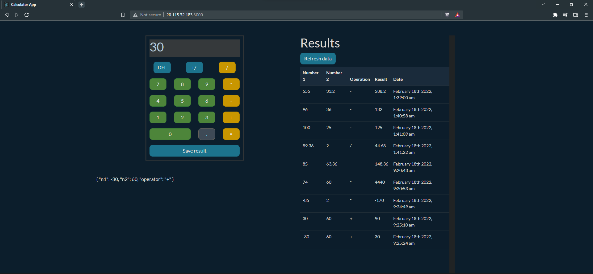
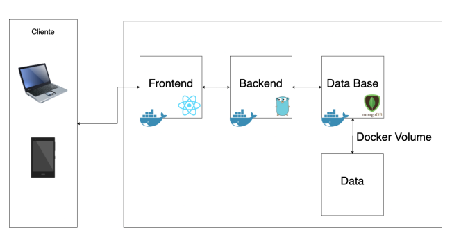

# PRACTICA #1 SISTEMAS OPERATIVOS

## Universidad de San Carlos de Guatemala
## Datos del estudiante:
Desarrollado por: Juan Antonio Solares
<br>
Carné: 201800496

## Descripción de la practica:

<p>
La practica consiste en una calculadora sencilla desarrollada en React con TypeScript, en la cual se realizan las cuatro operaciones aritmeticas básicas (suma, resta, multiplicación, división), que son registradas en una base de datos de <b>mongodb</b> para tener un log de cada operacion realizada (operandos, operador, resultado y fecha de operación).

Se utilizaron volumenes en docker para poder desplegar la arquitectura y exista persistencia de datos, es decir que al momento de parar los contenedores y volverlos a encender no exista perdida de datos.
</p>

:green_book:[Manual Usuario](#tag2)

# Vista de la aplicación



## Funcionalidades básicas
* Calculadora: Realiza operaciones aritmeticas (suma, resta, multiplicación, división)
* Guardar Resultado: Almacenar la operacion en la base de datos
* Tabla de resultados: Se muestra el detalle de todas las operaciones realizadas

:green_book:[Manual Técnico](#tag1)


<!-- ## Indice -->
:white_check_mark:[Requisitos previos](#req-previos)
* :large_blue_circle:[Frontend](#req-previos)

    * Node.js
    * npm
    * React
    * TypeScript

* :large_blue_circle:[Backend](#req-previos)

    * Golang
    * Fiber v2
    * Mongodb

* :large_blue_circle:[Docker](#req-previos)

  


:white_check_mark:[Arquitectura utilizada](#req-previos)

La siguiente imagen muestra una representación gráfica de la arquitectura realizada en esta aplicación.
<br>



```sh
# crear una carpeta que contendrá backend y frontend
mkdir sopes1_practica1
```

<h3>Configración de aplicación React </h3>

```sh
# acceder al directorio
cd sopes1_practica1

# generar aplicación React con Typesript
npx create-react-app calculator-app --template typescript

# acceder al directorio de la aplicación
cd calculator-app

# iniciar aplicación 
npm start

```
<h3>Configración de aplicación en golang </h3>

```sh
# crear una carpeta que contendrá el backend 
mkdir mongo-backend

## acceder a la carpeta del backend
cd mongo-backend

## Inicializar modulos de Go
go mod init mongo-backend

# Instalar las dependencias requeridas
go get -u github.com/gofiber/fiber/v2 go.mongodb.org/mongo-driver/mongo github.com/joho/godotenv github.com/go-playground/validator/v10


go get github.com/klauspost/compress

# Crear archivo main.go y todas las carpetas necesarias para formar la estructura del servidor

# ejecutar aplicación de golang
go run main.go


```

Es importante asegurar que la aplicación funcione tanto de la parte del backend y frontend para poder realizar las configuraciones de docker correspondientes.

### Configuraciones Docker

#### Instalacion de docker

```sh
sudo apt install docker.io
```


<!-- &nbsp;&nbsp;&nbsp;&nbsp;&nbsp;&nbsp; 3 -->