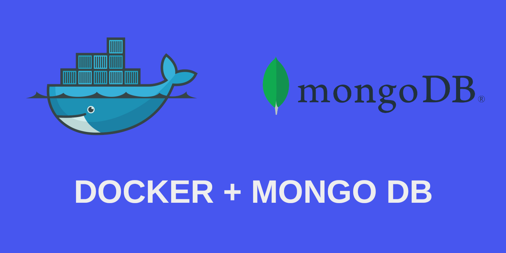
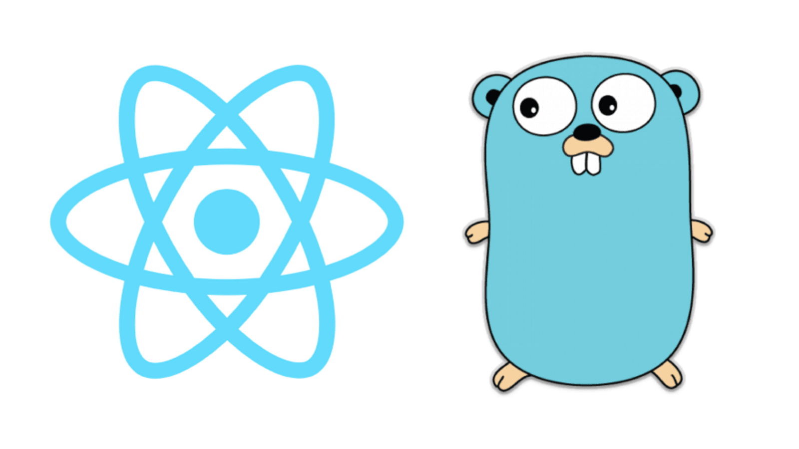

# PRACTICA #1 SISTEMAS OPERATIVOS





## Universidad de San Carlos de Guatemala
## Datos del estudiante:
Desarrollado por: Juan Antonio Solares
<br>
Carné: 201800496


# :green_book:[Manual Técnico](#tag1)


<!-- ## Indice -->
:white_check_mark:[Requisitos previos](#req-previos)
* :large_blue_circle:[Frontend](#req-previos)

    * Node.js
    * npm
    * [React](#react)
    * TypeScript

* :large_blue_circle:[Backend](#req-previos)

    * [Golang](#golang)
    * Fiber v2
    * [Mongodb](#mongodb)

* :large_blue_circle:[Docker](#req-previos)

    * [Configuración Docker](#docker)


:white_check_mark:[Arquitectura utilizada](#req-previos)

La siguiente imagen muestra una representación gráfica de la arquitectura realizada en esta aplicación.
<br>


```sh
# crear una carpeta que contendrá backend y frontend
mkdir sopes1_practica1
```

### Configración de aplicación React  <a name="docker"></a>

```sh
# acceder al directorio
cd sopes1_practica1

# generar aplicación React con Typesript
npx create-react-app calculator-app --template typescript

# acceder al directorio de la aplicación
cd calculator-app

# iniciar aplicación 
npm start

```
### Configración de aplicación en golang  <a name="golang"></a>

<p>
Es importante tomar en cuenta que es importante tener instalado Go, en esta aplicación
la versión utilizada es la 1.16.7. 
</p>

### Link sugerido
&nbsp;&nbsp;&nbsp;:link:[Instalación de Go en ubuntu](https://dev.to/hackmamba/build-a-rest-api-with-golang-and-mongodb-fiber-version-4la0)

```sh
# crear una carpeta que contendrá el backend 
mkdir mongo-backend

## acceder a la carpeta del backend
cd mongo-backend

## Inicializar modulos de Go
go mod init mongo-backend

# Instalar las dependencias requeridas
go get -u github.com/gofiber/fiber/v2 go.mongodb.org/mongo-driver/mongo github.com/joho/godotenv github.com/go-playground/validator/v10


go get github.com/klauspost/compress

# Crear archivo main.go y todas las carpetas necesarias para formar la estructura del servidor

# ejecutar aplicación de golang
go run main.go


```

Es importante asegurar que la aplicación funcione tanto de la parte del backend y frontend para poder realizar las configuraciones de docker correspondientes.

# Mongodb <a name="mongo"></a>

## ¿Qué es mongodb?
En lugar de guardar los datos en tablas, tal y como se hace en las bases de datos relacionales, MongoDB guarda estructuras de datos BSON (una especificación similar a JSON) con un esquema dinámico, haciendo que la integración de los datos en ciertas aplicaciones sea más fácil y rápida.

# Docker

## ¿Qué es docker? <a name="docker"></a>
<p>
Docker es una plataforma de software que le permite crear, probar e implementar aplicaciones rápidamente. Docker empaqueta software en unidades estandarizadas llamadas contenedores que incluyen todo lo necesario para que el software se ejecute, incluidas bibliotecas, herramientas de sistema, código y tiempo de ejecución. Con Docker, puede implementar y ajustar la escala de aplicaciones rápidamente en cualquier entorno con la certeza de saber que su código se ejecutará.
</p>

<p>
Docker proporciona una manera estándar de ejecutar código. Docker es un sistema operativo para contenedores. De manera similar a cómo una máquina virtual virtualiza (elimina la necesidad de administrar directamente) el hardware del servidor, los contenedores virtualizan el sistema operativo de un servidor. Docker se instala en cada servidor y proporciona comandos sencillos que puede utilizar para crear, iniciar o detener contenedores.
</p>


### Configuraciones Docker

#### Instalacion de docker

```sh
sudo apt install docker.io
```

### Generar contenderoes

```sh
# acceder al directorio 
cd app_folder

docker build -t <container_name> .

# correr contenedor en modo iteractivo (muestra logs en consola)
docker run -it -p 4000:3000 <container_name>

# correr contenedor en modo detach  (corre en segundo plano)
docker run -d -p 4000:3000 <container_name>

# parar contenedor
docker stop <id_container>

```

### Volumenes

```sh

# crear volumen de docker
docker run -d -v /Users/snowman/frontend/app/etc:/etc/frontend_p1_201800496 -p 3000:3000 frontend_p1_201800496_v2

# docker tag
docker tag 01551c602282 solaresjuan98/frontend_p1_201800496_v2

```

### Subir contenedor a Dockerhub

**Es importante tener un usuario creado en dockerhub

```sh
## Iniciar sesión en dockerhub (ingresar usuario y contraseña)
## En caso de estar en entorno local, verificara si existe una sesión iniciada
docker login

## Subir imagen a docker
sudo docker push solaresjuan98/frontend_p1_201800496_v2
```

## Enlaces de las imagenes en Dockerhub

### Frontend
:link:https://hub.docker.com/repository/docker/solaresjuan98/backend_p1_201800496

### Backend
:link:https://hub.docker.com/repository/docker/solaresjuan98/frontend_p1_201800496


# ANEXOS<a name="anexos">

&nbsp;&nbsp;&nbsp;:link:[Contenedores de docker](https://aws.amazon.com/es/docker/)

&nbsp;&nbsp;&nbsp;:link:[Backend con golang y mongodb con fiber](https://dev.to/hackmamba/build-a-rest-api-with-golang-and-mongodb-fiber-version-4la0)


<!-- &nbsp;&nbsp;&nbsp;&nbsp;&nbsp;&nbsp; 3 -->